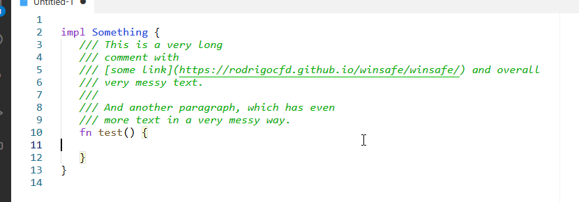

# Format Comment

A [Visual Studio Code](https://code.visualstudio.com/) extension that formats code comments to fit 80 chars max on each line.

## Usage

Select the comment lines and choose the **Format comment** command from your [Command Palette](https://code.visualstudio.com/docs/getstarted/userinterface#_command-palette).

## Example

